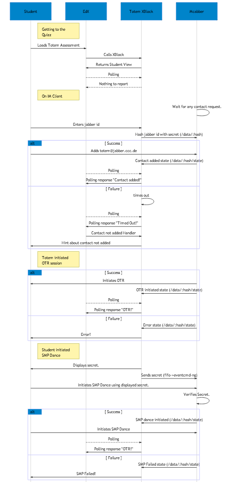

Totem OTR - EdX XBlock Module
=============================

Test a student's ability to use OTR instant messaging within an EdX Course.

## Usage

 - Install xblock-sdk as per tutorial (i.e. in xblock_development)
 - git clone https://github.com/iilab/totem-xblocks.git

To run in the SDK workbench
 - sudo nice -n 19 chroot --userspec www-data:www-data / sh -c 'cd /path/to/xblock_development; totem-xblocks/sdk.sh'

To deploy on EdX
 - ```root@Totem:/edx# bin/pip.edxapp install -e /opt/xblock_development/totem_otr```

## Design


